# Matrix Multiplication - IBM Cloud Implementation

## Prerequisites

Since the automated creation of resources does not work as expected all the time we have to create the services used by this application manually. These beeing the Object Storage and the Redis instance needed for parallel execution.

It is also necessary to have the current namespace of the CLI set to a CloudFoundry based one and to have the [OpenWhisk composer tools](https://github.com/apache/openwhisk-composer) installed

## Initializing Object Storage

### Step 1: Create Object Storage Instance

Search for "object storage" and select it.
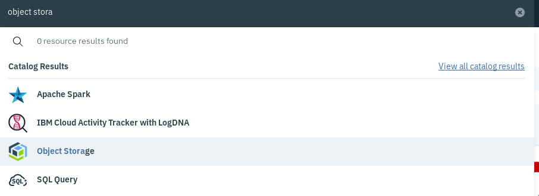

Assign a name to the object storage instance and choose a plan. Once done click "Create"
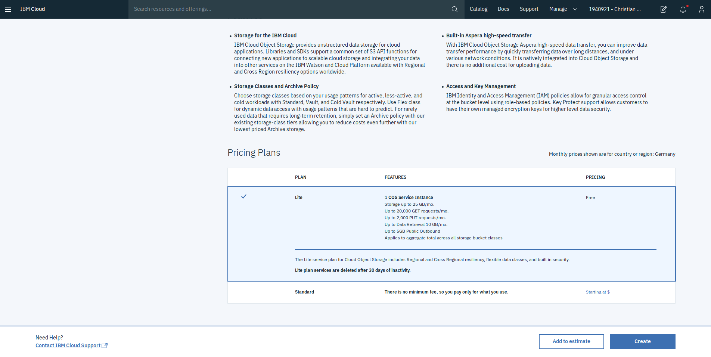

### Step 2: Generate Service Credentials
After creation you will be redirected to the management page of the object storage instance. Here select "Service credentials" in the menu on the left. Then Click new Credentials on the right. (highlighted blue on the image)
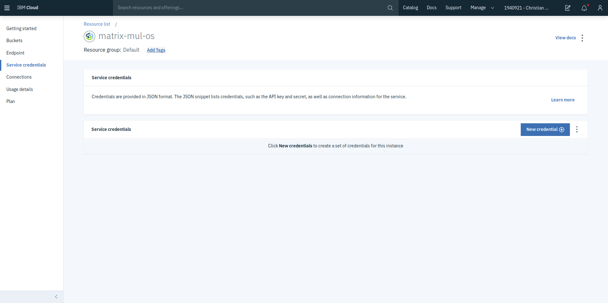
Next set the desired name of the credentials, select "Manager" as the role and activate the "Include HMAC Credentials". Inline Configuration Parameters do not have to be changed. `{"HMAC":true}` is automatically appended after Checking the beforementioned HMAC option. Finally confirm the creation with a click on "Add"
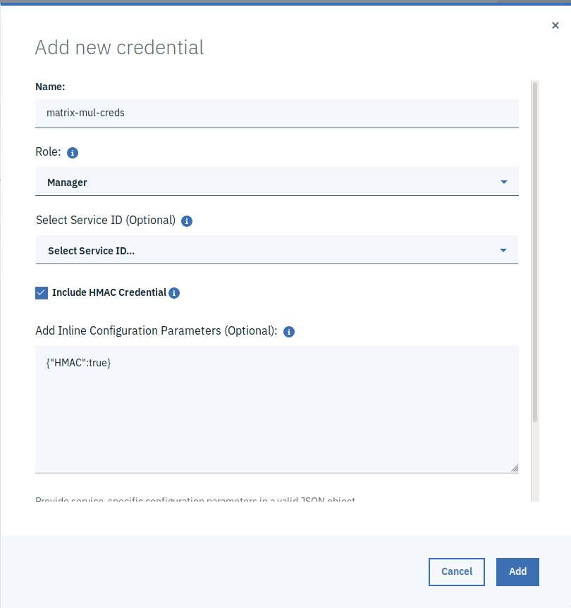

### Step 3: Copying credentials into `s3_credentials.json`

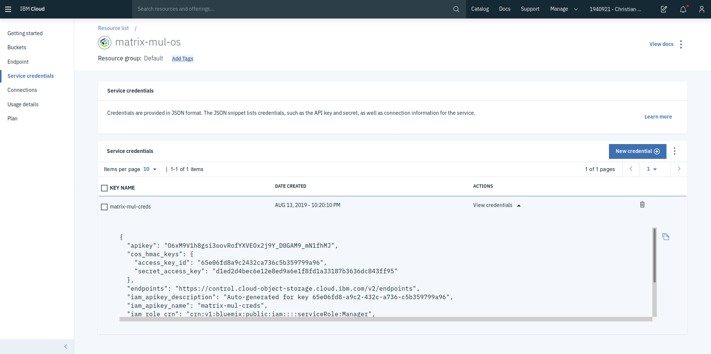

After the credentials have been created we can retrieve them by clicking on "View Credentials" the JSON that gets expanded contains both the access key and the secret key. Copy the values into the `s3_credentials.json` respectively
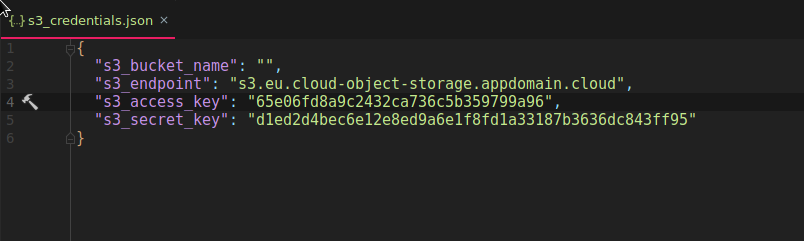

### Step 4: Creating a Bucket
Once the credentials click on the 'Buckets' menu entry on the left. Once loaded. Click the "Create Bucket" on the left."
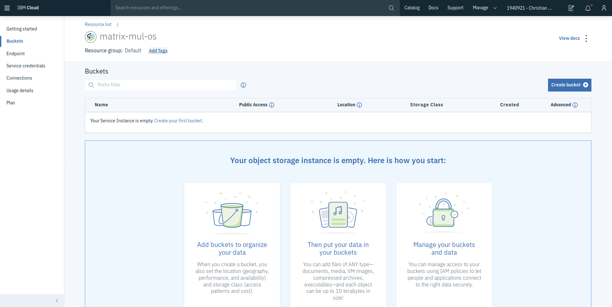
Next assign the bucket a name. As usual for S3 based object storage, the name is global across all buckets hosted by IBM.  It should therefore be very specific and should also contain a unique component. Once done Click create to create the bucket.
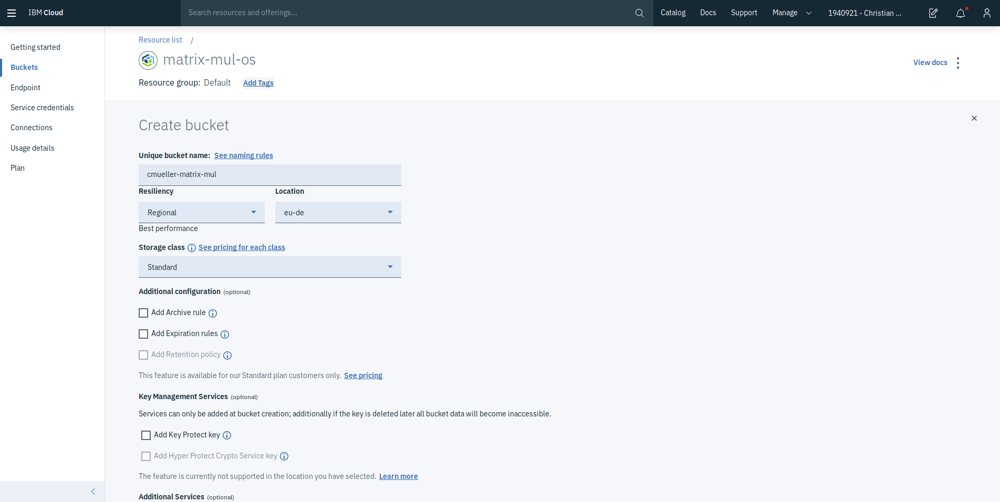

### Step 5: Setting the Bucket Name in `s3_credentials.json`

The final step to configure the Object storage is to copy the name of the bucket into the `s3_credentials.json` file. under the `s3_bucket_name` key.
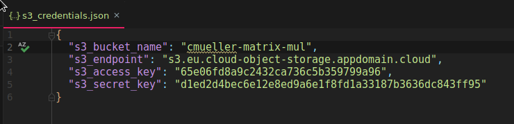

## Initializing Redis

To use the parallel feature of IBM Composer we need a redis instance. That we have to pass inte the workflow every time we launch it using the `-P` flag.

### Step 1: Create a new Redis instance
First use the search bar to search for `database for redis` and then select it from the list.
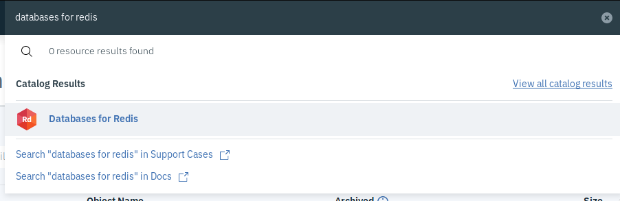

Mext emter a name, select a service region and a service plan. Once done click Create.
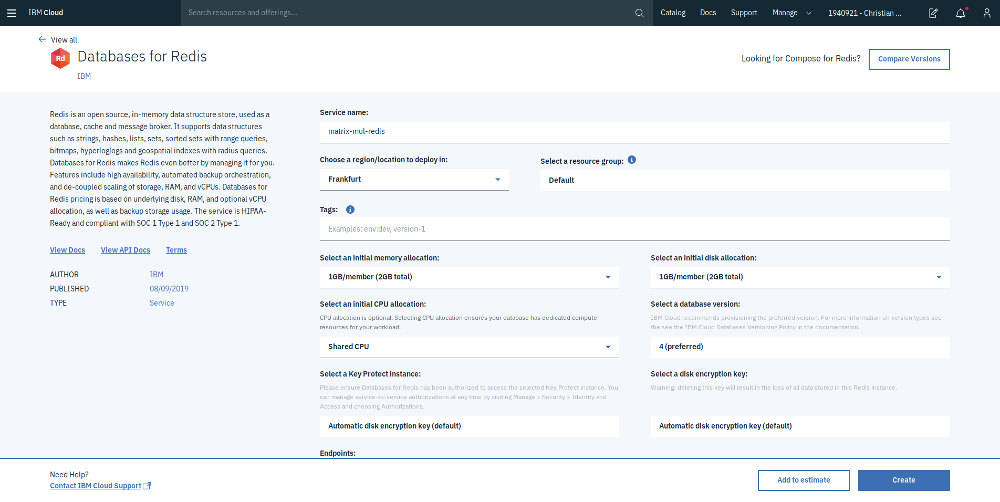

Once done you will be redirected to the resource list because the creation of the instance takes some time. As long as the status says `Provision in Progress` it is still deploying the database. In order to check the state you might also have to reload the page.
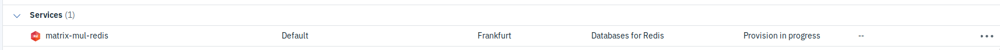

### Step 2: Generating Credentials
Once the instance is provisioned you can open the configuration interface by clicking on the name. This will redirect you to the UI of the database instance.  There you have to select Service credentials in the menu on the Left and then click on "Create Credentials"
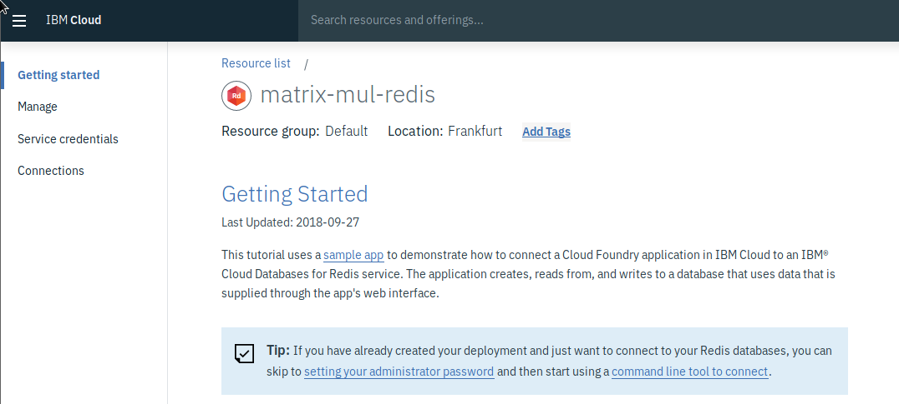

This will open the following window
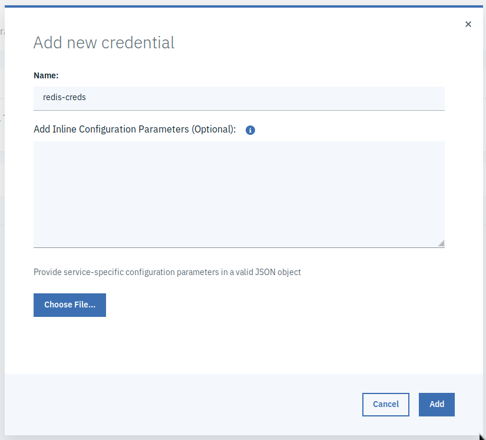

Here you just have to define a name and click Add.

### Step 3: Setting credentials in `redis_credentials.json`
The newly created set of credentials should show up in the list. Click on view credentials on the newly created one to get the following view.

Here select the second string in the `$.connection.cli.arguments` array and copy it into your clipboard.
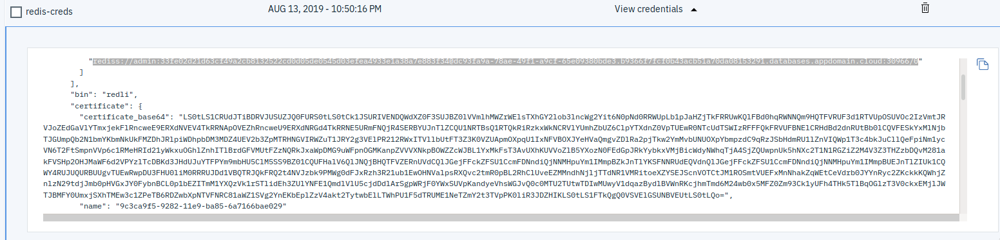
Next paste the value in the `$.$composer.redis.uri` field
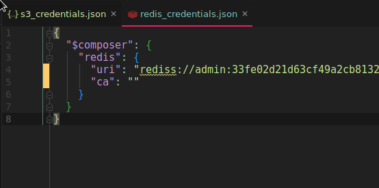

Once the URI is copied also copy the value of the `$.connection.cli.certificate.certificate_base64` field to your clipboard
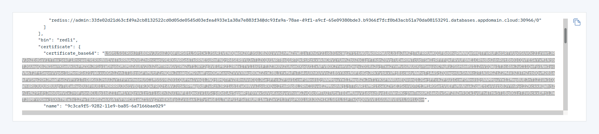

and paste it as the value of the  `$.$composer.redis.ca` field.
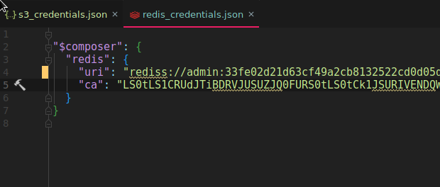

FInally do not forget to save the files.

## Deploying

Once all dependencies are created we can deploy the composition by running:

```bash
make deploy
```

Once deployed the deployment can be updated using

```bash
make update
```

## Invoking

To invoke the workflow with the default parameters you can use the `make invoke` command. How the functions are invoked otherwise is described in the General matrix multiplication [Readme](../Readme.md).

## Destroying

To remove the actions `make destroy` can be used however the bucket and the redis instance have to be deleted manually.
