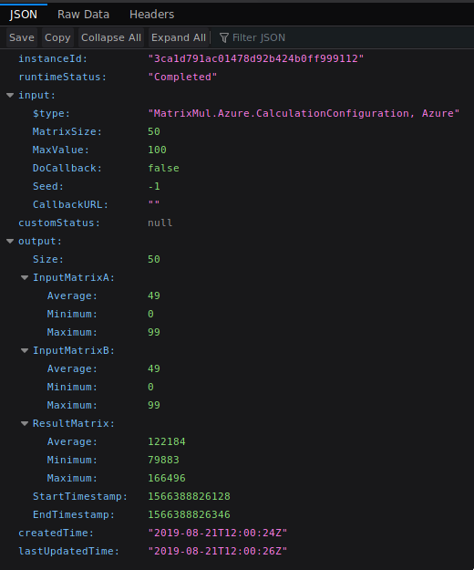

# Matrix Multiplication - Use Case

## Prerequisites

Generally all of these applications have the following prerequisites:
- .NET Framework Core SDK - Version 2.1 (including `dotnet` command)

## Parameters

All three implementations can be configured by some meas. They all allow you to set the following parameters:
- Size: The size of the matices to generate (Default is 125)
- Max Value: The maximum value of an element in the generated source matrices A and B. (Will result in values between `0` and `Max Value - 1`) The default is 100
- Seed: The Random number generator can be seeded to allow deterministic testing of the workflow. By default no seed is chosen
- Callback URL: The `GenerateReport` function will `POST` the created report to the set URL if it is defined. (Does not work on IBM Cloud)

All these parameters are optional. If they are not set the defaults will be used.

## Unit Tests

Unlike all other Implementations this implementation has Unit tests to test the functionallity of the Core library.

### Running the Unit Tests

The unit tests can be executed by running the following commands in the `Tests` subdirectory:
```
dotnet restore # Only needed once
dotnet test
```

Sadly this approach of running the tests does not show any output apart from failures. To see the full Test ouptut please consider
using an IDE like JetBrains Rider or VisualStudio.

## Validating the deployments functionality

The functionality can be validated by running the function workflow with specific parameters. This will result in the same input matrices and will therefore also result in the same result matrix if everything works properly. A simple check to find out if the matrices are identical is to compare the minimum, maximum and average of the result matrix as the Report returns them. While it is theoretically possible to get the same results even if an error was implmented in the application such an event has a very low probability and we are assuming for simplicity that such an event will not occur because it is probably just of theoretical nature.

### Parallel Test

#### Configuration

The following configuration should be used for the test:

- `size`: 50
- `max`: 100
- `seed`: 123321

**Launching on AWS**: To launch the test configuration on AWS use the following `curl` command: 
```bash
curl -d '{"MatrixSize": 50, "MaxValue": 100, "Seed": 123321}' <YOUR_ENDPOINT>
```

Optionally you can also add the "CallbackUrl" parameter in combination with a [Hookbin](https://hookbin.com) endpoint to make the retrieval of the report easier.

To retrieve the report you can also use the ARN thats returned when posting to the URL. By running the following command:

```bash
aws stepfunctions describe-execution --execution-arn <RETURNED_EXECUTION_ARN>
```

The output this returns is usualy json. If the execution is done the state turns to `SUCCEEDED`. If the state is `PENDING` or `RUNNING` the result is not ready yet. Try running the command again after some time has passed.

Once succeeded the output field contains the Generated report in an escaped string. To print the report unescaped you can run the following command:

```bash
aws stepfunctions describe-execution --execution-arn <RETURNED_EXECUTION_ARN> | jq -r ".output" | jq
```

However this requires you to be authenticated with the AWS CLI.

**Launching on Azure**: to launch on Azure the following `curl` command can be used:

```
curl "https://cmuellermatrixmul.azurewebsites.net/api/triggermatrixmultiplication?size=50&max=100&seed=123321" | jq '{status: .statusQueryGetUri, terminate: .terminatePostUri'
```

This returns a simple and easy to read json object containg the status query URL as well as the url that can be used to terminate the query if it is running for too long.

When opeing the status query URL in a browser it looks like this


If `runtimeStatus` is `Completed` the execution is done. Then the report can be found under the output field.

**Launching on IBM**: To invoke the workflow in IBM we have to use the `ibmcloud` CLI because we also have to submit the redis credentials. To start a multiplication here run the following command:
```bash
ibmcloud fn action invoke workflow -r -P redis_creds.json -p size 50 -p max 100 -p seed 123321
```
Ths command will wait for the workflow to finish. Once finished the report will be returned.
`redis_creds.json` represents the path to the json file created during the deployment of the function workflow.


#### Expected Report

The values should be identical across all deployments. Apart from the Timestamps.

```json
{
  "Size": 50,
  "InputMatrixA": {
    "Average": 49,
    "Minimum": 0,
    "Maximum": 99
  },
  "InputMatrixB": {
    "Average": 49,
    "Minimum": 0,
    "Maximum": 99
  },
  "ResultMatrix": {
    "Average": 121672,
    "Minimum": 78312,
    "Maximum": 168397
  },
  "StartTimestamp": 1566385206305,
  "EndTimestamp": 1566385206314
}
```

### Serial Test

#### Configuration

The following configuration should be used for the test:

- `size`: 9
- `max`: 100
- `seed`: 123321

To launch the tests just follow the instructions above. Just make sure to modify the parameters accordingly

#### Expected Report

The values should be identical across all deployments. Apart from the Timestamps.

```json
{
  "Size": 9,
  "InputMatrixA": {
    "Average": 51,
    "Minimum": 0,
    "Maximum": 96
  },
  "InputMatrixB": {
    "Average": 52,
    "Minimum": 0,
    "Maximum": 99
  },
  "ResultMatrix": {
    "Average": 24261,
    "Minimum": 11830,
    "Maximum": 40247
  },
  "StartTimestamp": 1566385384086,
  "EndTimestamp": 1566385384092
}
```