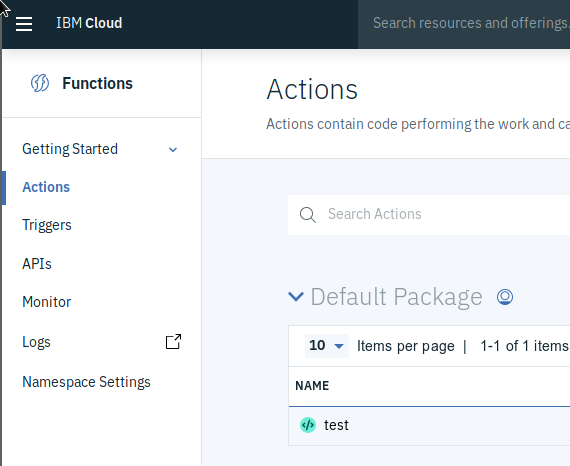
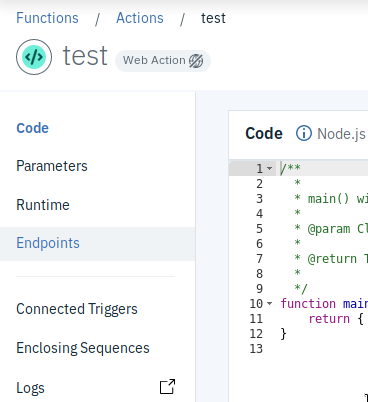
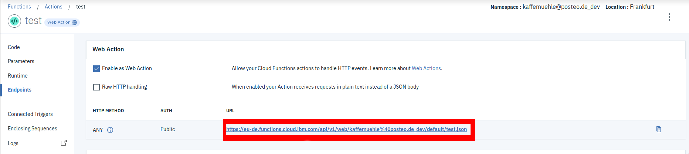

# Thumbnail Generator - IBM Implementation

This is the IBM Cloud implementation of the Thumbnail Generator. Unlike the other implementations IBM considers this feature experimental. It therefore is only available in the `us-south` (Dallas) region

## Deployment

### Step 1: Creating an Object Storage instance and a Bucket

How an Instance of the object storage and a Bucket is created is described in depth in the readme of the
Matrix Multiplication use-case on IBM [here](/MatrixMultiplication/IBMCloud). The procedure here is mostly identical however there are some differences:

- Instead of placing the HMAC Credentials in a JSON file they have to be set in the `Makefile` (see below)
- The buckets created must have the Region `us-south` (Dallas) otherwise the implementation will not founction.

You have to create two buckets an Input and an Output bucket. Their names have to be also set in the `Makefile`:

```makefile
# Defines the name of the input bucket used to upload Images to
OBJECT_STORAGE_INPUT_BUCKET := krnl-tgen-uss
# Defines the name of the output bucket used to thumbnails to
OBJECT_STORAGE_OUTPUT_BUCKET := krnl-tgen-uss-thumbnails
# Access Key to Object Storage with Manager Permissions
OBJECT_STORAGE_ACCESS_KEY := 83233f26ea46473189aca35dc634ca63
# Secret Key to Object Storage with Manager Permissions
OBJECT_STORAGE_SECRET_KEY := d06b121718b21dbe694fb2be6963d91137b47c884040adf1
```

While the endpoint attribute is only used by the Actions themselves it should not be modified unless IBM deploys this feature everywhere.

### Step 2: Creating the Namespace and Service Bindings

To create a Namespace in Dallas we first have to change the region and after that step we can create a new namespace. This is done by running `make init`. However the commands fail sometimes. To fix this Logging out and back in again resolves this problem in most cases. Sometimes you also have to create a namespace before the region changes. Thats why it is mandatory to validate the location of the namespace after the command has been executed. Doing this can be done using the web interface by viewing the resource list.

### Step 3: Deploying the Actions

To deploy and build the actions just run `make deploy`.

### Step 4: Creating the Trigger and Rule

The trigger is created by running:

```bash
make create_trigger
```

After the creation of the trigger the `generator` Action and the trigger have to be connected using a Rule,
That is done by running:

```bash
make register_rule
```

### Updating the Actions

The Actions can be updated using the `make update_actions` command.

## Testing

### Uploading an Image using the upload function

Handling the upload on OpenWhisk is tricky because WebActions cannot consume generic strings as bodies. They have to be encoded in JSON. To resolve this we have to encode the image as base64, like the AWS and Azure Implementations of the Upload fuction. But unlike them we also have to wrap the base64 encoded image in a json object. The expected format of the object looks like this:

```json
{
    "filename":"<Filename in the ObjectStorage>",
    "data": "<Base64 Encoded image>"
}
```

To encode an image in such a way the following command can be used in `bash` (`sh`):

```bash
echo {\"filename\":\"myimage.jpg\", \"data\": \"`echo myimage.jpg | base64 -w0`\"} > encoded_image.json
```

Where `myimage.jpg` represents the name of the image and `encoded_image.json` the name of the output file.

To upload you can either invoke the action using the IBM CLI by running:
```
ibmcloud fn action invoke uploader -r -P encoded_image.json
```

Another approach is to use a URL retrievable through the Web UI as follows

**NOTE**: The images use an empty action called `test` to illustrate the Location of the URL.

First open Cloud Functions Web Interface for the IAM based namespace of the Thumbnail generator. Once open Click on `Actions` in the left menu and select the `uploader` function.



Once open select `Endpoints` in the menu on the left.



The next page allows you to retrieve the URL. Because the `uploader` function is created as a web action the "Enable as Web Action" option should be checked. If not Check it and click save. The first entry in the table directly under the "Raw HTTP handling" Checkbox is the URL you want. (it should end with `.json`, Highlighted red in the image) Copy the URL for use next.



This url can now be used to `POST` the encoded image to the function by running:

```
curl -d @encoded_image.json <Action URL>
```

To test the functionality of the use-case we are providing some pre encoded json files containing two images ([See test-images](../test-images)). The folder also contains the expected result for both files.

To retrieve the created thumbnails the web ui of the cloud object storage can be used.
