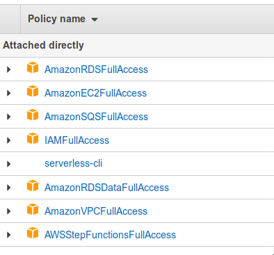

# Configuring IAM Roles for the Serverless Framework and AWS CLI

To configure the Serverless CLI you can generally follow the guide in their [Documentation](https://serverless.com/framework/docs/providers/aws/guide/credentials/). However the roles assigned by the [Linked Gist](https://gist.github.com/ServerlessBot/7618156b8671840a539f405dea2704c8) are not sufficient for our needs. The [`aws-roles` Subdirectory](aws-roles/) contains all the roles we have assigned to the IAM user. Most of them are probably not neccessary but granting everything made the development workflow much faster.

Instead of uploading every single JSON file you can also select the extra roles we have assigned from their templates:

The `serverless-cli` one is the Gist mentioned Above.
