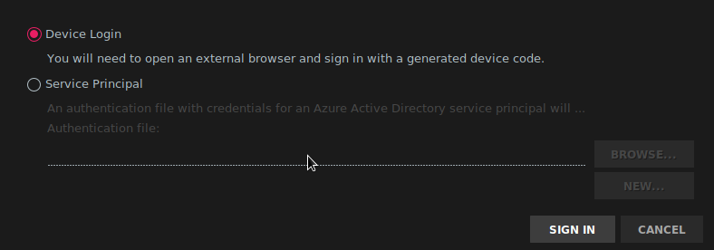
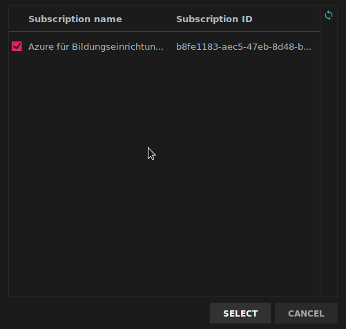
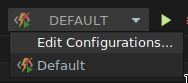
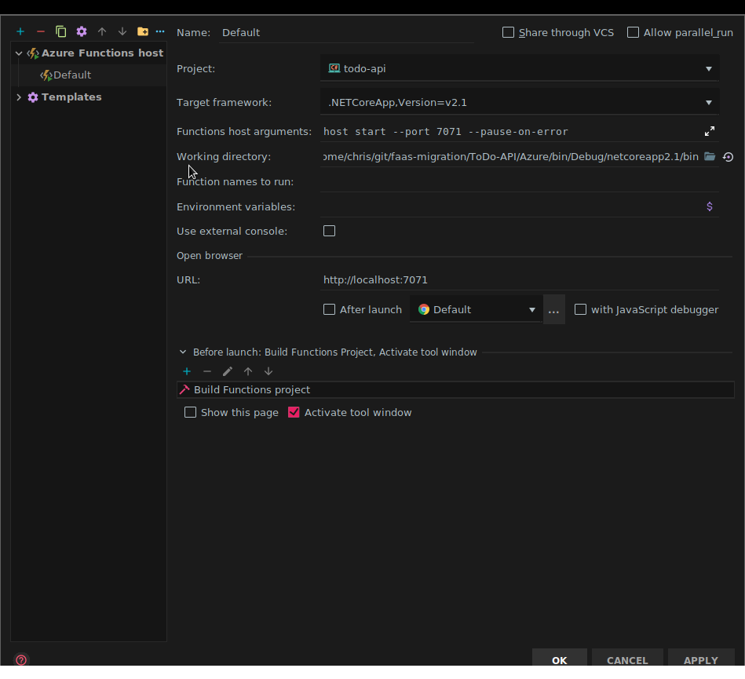
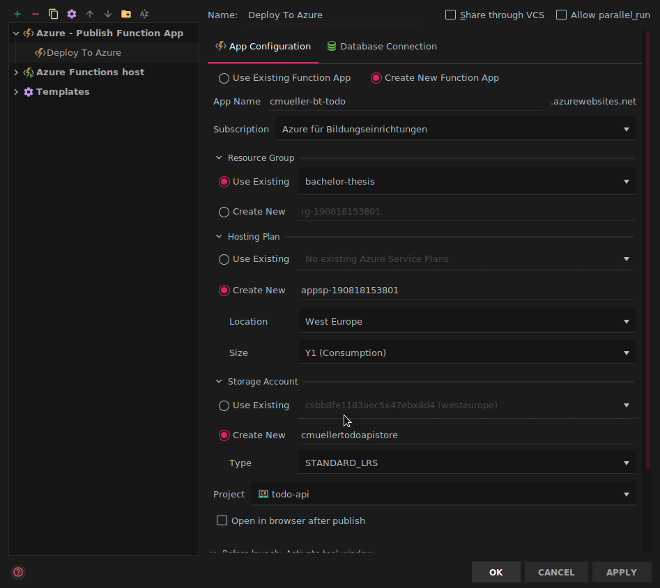
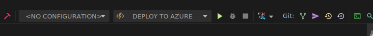
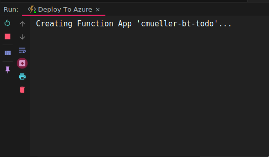
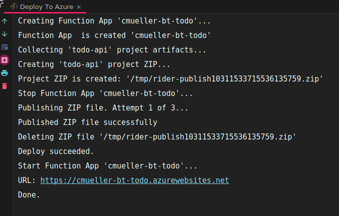

# General Azure Deployment Guide

This Guide applies to all Azure implmentations in C#. More Specifilally the ToDo API and the MatrixMultiplication

## Prerequisites

The following commands are requried to deploy and run these use-cases

- Azure CLI
- Azure Functions Core Tools
- .NET Core SDK Version 2.1

We assumed that the login using `az login` was successful.

Only when working with make:

- Linux based environment (Others are untested!)
- `jq`
- `make`
- `sponge` (moreutils)
- A Previously created Resource Group

Links to the tools mentioned here can be found in this [Document](/docs/tools.md)

## Deployment

### Variant 1: Using `make`

#### Step 1: Customizing `Makefile`

The configuration section in the beginning of the `Makefile` defines the names of the services that should be created.
You also must define the name of a previously created resource group there.

```makefile
# Define The name of the Resource Group to deploy in (must exist)
RESOURCE_GROUP_NAME := faas-migration
# Define the name of the storage account (gets created if not present)
STORAGE_ACCOUNT_NAME := cmuellermtrxmulstore
# Define the Name of the Function App (gets created if not present)
FUNCTION_APP_NAME := cmuellermatrixmul
# Define the name of the Application insights instance used for tracing/logging (gets created if not present)
APPINSIGHTS_NAME := cmuellermatrixmulai
# Set the name of your preferred region e.g. westeurope, westus...
AZURE_REGION := westeurope
```

A important side note: The name of the Storage Account and the Function App must be unique globally. because the script
might crash if the resources already exist outside of your namespace. We recommed a name that is most likely unique.
In case you have no ideas: generate some random passwords built from lower case letters and numbers using a password generator
like `pwgen` (<https://linux.die.net/man/1/pwgen>):

```bash
pwgen -1 -A 16
```

#### Step 2a: Running Locally

To run the function app locally just run

```bash
make run_local
```

This command creates the mandatory resources, updates the connection string in the `local.settings.json` and launches the function host.

if no further modifications occur in the cloud environment you can call the following command to speed up the process:

```bash
func host start
```

After you called the make command once, ensuring the resources and the configuration is written.

On the function host is up and running the Application is accessible on http://localhost:7071/

#### Step 2b: Deploying to Azure

To deploy to Azure just excecute the following command:

```bash
make deploy
```

This will create the necessary components running
including a Application Insights instance used for monitoring.

To update the source code in the cloud you can either rerun the command or use the following set of commands:

```bash
# Deploy the Application
func azure functionapp publish <APP NAME>
# Update the Function App Configuration based on "appsettings.local.json"
func azure functionapp publish <APP NAME> -o
```

### Deploy using JetBrains Rider

Apart from the Azure CLI and the Azure Functions Core Tools this approach also requires the Azure Toolkit for Rider.

#### Step 1: Sign Into Azure in Rider

First double press Shift to open the Command Window. There search for 'Sign in', Select the "Sign into Azure" option and press Enter.

Next the follwoing window is shown. When using Device Login you will have to sign in to azure using your browser. Access is for Rider is granted by Pasting a code. Similiar to the login process for the Azure CLI


Once signed in slect the subscriptions you want to use.


#### Step 2: Creating the Deployment Configuration

On the Top Right slect the Menu left to the Play Button (Usually named "Default"). Click on it and select "Edit Configurations"

Click the "+" on the top left and select "Publish Function App"

Next select the options accordingly. As a Example a configuration to create all required resources is shown in the following screenshot.

Once done Close the window by Clicking OK

#### Step 3: Deploying

Now Ensure your deployment configuration is selected (it should by default) and click the run button


The console output on the bottom shows the progress of the deployment.

After some time it should look like this:


#### Step 4: Updating the Deployment

To update the deployment just rerun the deployment configuration.

## Removing the Deployed Application

The deletion of the Application and its dependencies is not automated. It is therefore necessary to remove the resources manually. For example, by using the [Azure Portal Web Interface](https://portal.azure.com).
