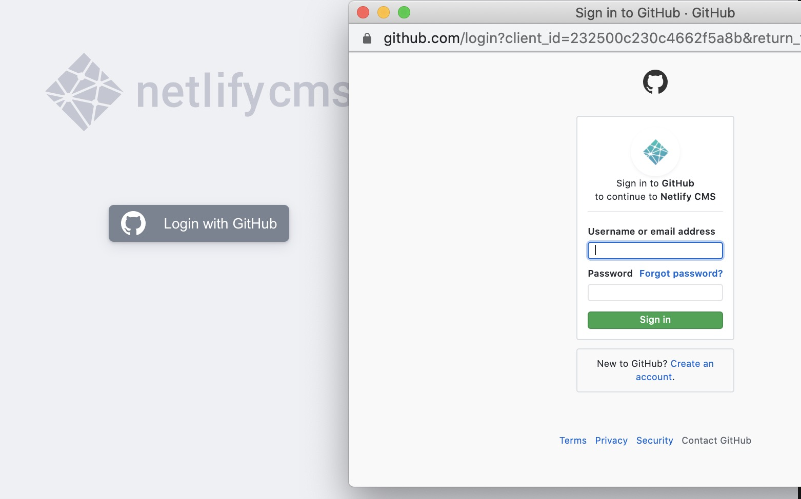
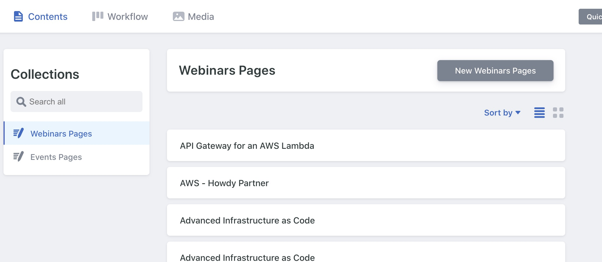
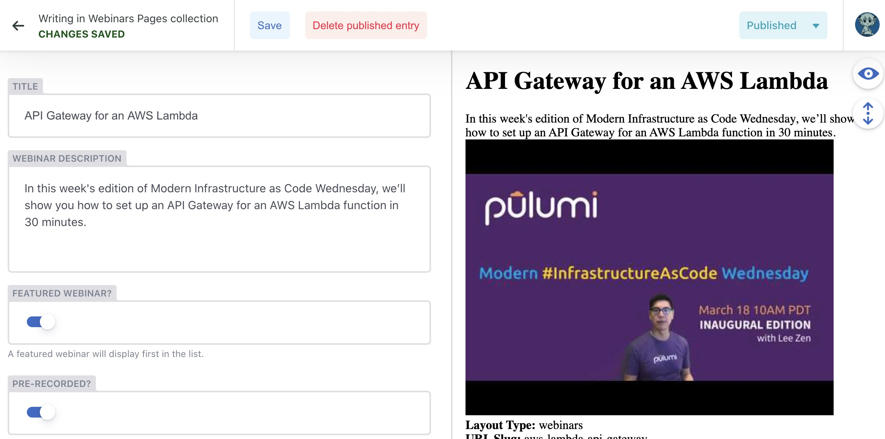
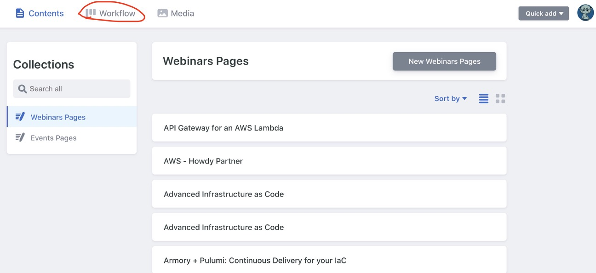
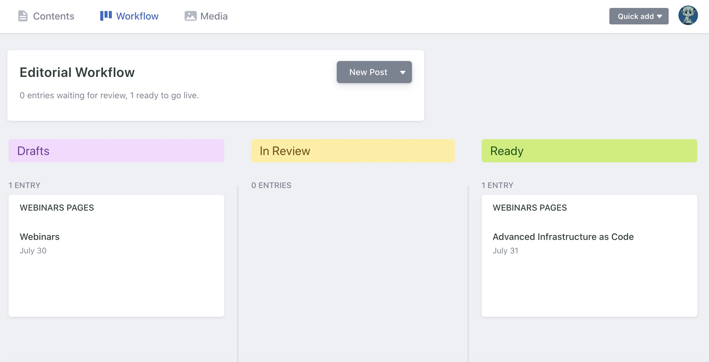

## Background Knowledges
CMS stands for content management system, which facilitate creation and modification of digital content.

[Netlify CMS](https://www.netlifycms.org/docs/intro/) is an [open-source](https://github.com/netlify/netlify-cms) example implements this concept.  It works closely with static site generators and provides user interface for non-technical editors of webisite to edit the website content and submit the change to various types of storaging service including Github.

Backends allows Netlify CMS to communicate with a service that stores content. Backends that Netlify CMS provides includes Git Gateway (Connect with Netlify), Github, GitLab, and Bitbucket.

# About CMS Project
This project is an CMS React App that using Netlify CMS as CMS provider and Github as backend. Orginally it provides a user interface for non-technical employees from Pulumi to edit [Pulumi's website](https://github.com/pulumi/docs) (powered by [Hugo static site generator](https://gohugo.io)). 
It is a good example for how to deploy Netlify CMS as a stand-alone React web application that is reading and make changes to another organization repository and deployed on AWS instead of Netlify.
Special thanks to the template provided by [@talves](https://github.com/ADARTA/netlify-cms-react-example
) for converting the CMS to be a stand-alone React app that is not placed inside the target repository.

## File Path

- .github/workflow
  - The implementation of Github Actions workflow
- cms/infrastructure
  - The infrastructure of deploying cms app on AWS using Pulumi.
  - index.ts contain the code for the Pulumi program
- cms/public
  - config.yml is the Netlify CMS's configuration file
  - favicon.ico the icon for CMS app website
  - index.html the html for the web app to check
- cms/Readme-Screenshots
  - The screen shots for this README file
- cms/src
  - React content for this web app

## Infrastructure

The infrastructure folder contain Pulumi code of deploying this CMS app onto the AWS S3, speeding up using AWS CloudFront, and certificate creation using AWS Certificate Manager. The general idea is deploy the CMS application as a static website onto the AWS. We already have a [Pulumi's static website creation example](https://github.com/pulumi/examples/tree/master/aws-ts-static-website) with explanation provided.

The infrastructure requires three stack configuration properties: `pathToWebsiteContents`, `targetDomain`, `certificateArn`.
- pathToWebsiteContents
  - The path to the builded content of this React Website app.
  - Run a yarn build will create a build folder which contains the builded file and we should pass the directory of the build folder to this variable.
  - Passing build folder instead of the whole folder is to put a worked version onto AWS S3 bucket for CloudFront to look for
- targetDomain
  - a target domain name that you wish to put into.
  - we used a subdomain of a parent domain and the parent domain have to be alive on your AWS account's Route 53 console it would automatically create the subdomain for you
  - this is also the site_domain you should put inside the cms/public/config.yml for Netlify CMS to read
- certificateArn
  - This is optional.
  - If you have already had a certificate inside the AWS's Certificate Manager for this CMS app, then put it's arn as the value for this variable

### Assume Role (Optional)
It is recommended that you use an IAM role with more permissions in the _target_ AWS using a token for an IAM user in the _source_ account. To do this, you could refer to the [aws-ts-assume-role example](https://github.com/pulumi/examples/tree/master/aws-ts-assume-role) for more information. The example is available in multiple languages in our [examples repostiory](https://github.com/pulumi/examples).

## Substitution for Netlify Identity Service: OAuth Server
Since we are deploying the CMS app on AWS instead of Netlify we need to provide our own server to do the OAuth [authorization code grant flow](https://oauth.net/2/grant-types/authorization-code/). So we also deployed an OAuth Server. Here's the official Netlify documentation on using [external OAuth clients](https://www.netlifycms.org/docs/external-oauth-clients/). In short, the OAuth server fetches the access token from GitHub API to use the CMS. The code for the OAuth Server is inside the `./cms-oauth` folder in the root directory of this example.

After deploying the cms-oauth web app, we should also put the domain of the oauth-server we build in the cms/public/config.yml's base_url configuration

## Code Path

1.  Since the CMS is implemented as a React app, the entry point is in **public/index.html** which includes multiple scripts and the div with id `root` for rendering the CMS component inside it.

1. App.js then create NetlifyCMS component instance from **src/components/NetlifyCMS** folder.

1. **src/components/NetlifyCMS/index.js** specify the behavior for NetlifyCMS and we could register CMS custom templates, custom widget there. 

1. `CMS.init()` will initialize CMS using **public/config.yml** which is the core of this app, which contains collection, backend settings, and other settings.

## Development Details
Now Github workflow was implemented. Directly push to master branch would automatically deploy cms.
Open a new branch and commit to the new branch would only do a pulumi preview until merge, which you could see from the Github Actions. For testing:

### Local Development

1. Specify the `repo`, `site_domain` and `base_url` in the `cms/public/config.yml`'s backend block.

  `repo` is the target repo you would like CMS to view and make edits on
  `site_domain` is the domain name for the CMS web application
  `base_url` is the domain name for the OAuth server (deployed from the `cms-oauth` folder)

1. To run the CMS app locally, run:

```bash
yarn start
```

It would automatically update if you made another change to `config.yml`

### 
1. Build the App

```bash
yarn build
```
This would build the App and create a build folder under root directory. 

2. Go to infrastructure folder config the Pulumi stack

```bash
$ cd infrastructure
$ pulumi stack init website-cms
$ pulumi config set aws:region us-east-1
$ pulumi config set website-cms:pathToWebsiteContents ../build
$ pulumi config set website-cms:targetDomain https://some-cms-domain.com
# the targetDomain have to match what you put for site_domain inside the config file ./cms/public/config.yml
```
- path to website contents would specify the folder generated by `yarn build` and upload that folder to S3

- target domain is the domain for the app

4. Run pulumi up
```bash
$ pulumi up
```

## CMS UI Introduction

> Before you can login into the CMS app, you must complete the steps in the OAuth server to either run it locally or deploy it to the cloud.

1.  Open up a server with working example with

    ```bash
    $ yarn start
    ```
    it will automatically updated the page with any changes.

2.  Login using Github account.

    

3.  Click on any page you want to edit at collections page or add new page using the "New Webinar/Event Page" button

    

    Fill in in specified field at the entry page

    

4. Click **Save** button at the top of the editing page would 
- Create a new branch in your target repo
- Open a pull request 
- Make initial commit to the branch
- Adds tag to the PR that indicates that it is a "draft"
- Adds a card in the drafts column on the editorial workflow page (more on the workflow UI below)

5. Click the Back button to go back to the collections page and clicking the **Workflow** button would bring out the editorial workflow

    

    

6. Moving a card from the "Drafts" column to the "In Review" column will remove the "draft" tag and apply an "in-review" tag on the PR

7. Similarly, moving a card from "In Review" to "Ready" columns would change the PR tag to "ready"

8. Hover on the card in "Ready" column would show **Publish change** button, which would merge the PR.


